# Current Implemented Queue Architecture

Status: `Implemented`

This document describes the queue-processing architecture that is actually implemented today.
It is the best debugging view for operational issues because it reflects the current queue lanes, worker ownership model, and transitional seams that still exist.

## Current Runtime Shape

```mermaid
flowchart TB
  subgraph OP["Operator + Web Layer"]
    UI["Next.js Dashboard + APIs<br/>submission, inspection, drill-down"]
  end

  subgraph CTRL["Backend-Owned Queue Control"]
    REQ["Request Worker<br/>RequestSupervisorGraphRuntime"]
    CONTACT["Contact Worker<br/>FieldJobSupervisorGraphRuntime + FieldJobGraphRuntime"]
    REPAIR["Repair Lane<br/>chapter_repair_jobs claim/process loop"]
    EVAL["Evaluation Worker<br/>evaluation_jobs claim/process loop"]
  end

  subgraph EXEC["Execution Paths"]
    CRAWL["Crawl Graphs<br/>legacy + adaptive crawl orchestration"]
    FJ["Contact Resolution Graph Path<br/>langgraph_primary default"]
    REPAIRFLOW["Repair Actions<br/>promote / downgrade / invalid / exhausted"]
    EVALFLOW["Benchmark + Campaign Execution<br/>per-run jobs, strict/shared isolation"]
  end

  subgraph DATA["Postgres / Supabase"]
    REQUESTS["fraternity_crawl_requests"]
    FIELDJOBS["field_jobs<br/>typed queue state"]
    REPAIRJOBS["chapter_repair_jobs"]
    EVALJOBS["evaluation_jobs"]
    WORKERS["worker_processes"]
    ALERTS["ops_alerts"]
    PROVISIONAL["provisional_chapters"]
    RUNS["crawl_runs / request_graph_runs / field_job_graph_runs / benchmark_runs / campaign_runs"]
  end

  UI --> REQUESTS
  UI --> EVALJOBS
  UI --> RUNS
  UI --> ALERTS

  REQ --> REQUESTS
  REQ --> CRAWL
  REQ --> REPAIRJOBS
  REQ --> FIELDJOBS
  REQ --> PROVISIONAL

  CONTACT --> FIELDJOBS
  CONTACT --> FJ
  CONTACT --> RUNS

  REPAIR --> REPAIRJOBS
  REPAIR --> REPAIRFLOW
  REPAIR --> PROVISIONAL

  EVAL --> EVALJOBS
  EVAL --> EVALFLOW
  EVAL --> ALERTS
  EVAL --> RUNS

  REQ --> WORKERS
  CONTACT --> WORKERS
  EVAL --> WORKERS
```

## What Is Fully Implemented

- Request execution is backend-owned and lease-based.
- Contact resolution defaults to the graph-native runtime path.
- Repair is a durable lane through `chapter_repair_jobs`.
- Benchmarks and campaigns are backend-owned through `evaluation_jobs`.
- Operational alerts are persisted in `ops_alerts`.
- Provisional chapters can now transition beyond `open`.
- Agent Ops exposes queue-lane state for:
  - actionable contact work
  - deferred contact work
  - blocked invalid work
  - blocked repairable work
  - queued/running/completed repair work
  - open alert backlog

## What Is Still Transitional

- The web app still contains orchestration-adjacent repository logic and operator actions, even though it no longer owns durable runtime scheduling.
- Campaign and benchmark detail models still rely on direct repository reads rather than dedicated projection tables.
- Some diagrams and historical docs still describe the target graph-native architecture more cleanly than the implementation currently is.
- Request and campaign read models are improved, but not all operational surfaces use precomputed summary projections yet.

## How To Read This Against Other Diagrams

- Use this document for operational debugging and implementation audits.
- Use `V4_PLATFORM_ARCHITECTURE.md` for the migration-period platform view.
- Use `V3_SYSTEM_OVERVIEW.md` for the intended end-state architecture after the remaining convergence work is complete.
