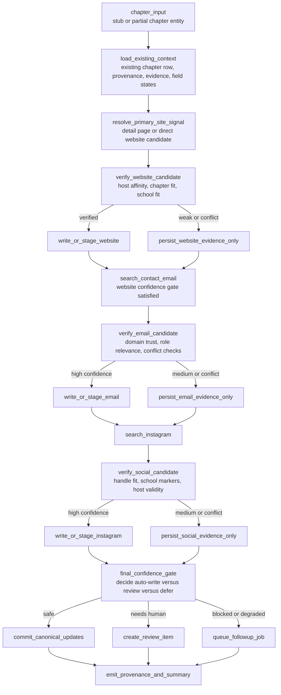

# V3 Chapter Resolution Graph

This subgraph resolves one chapter entity from partial evidence into a confidence-scored canonical update, review item, or deferred follow-up.

It makes the write policy explicit:

- high-confidence values can auto-write
- medium-confidence values persist as evidence and route to review
- blocked or degraded cases queue deferred work

## Chapter Resolution Subgraph

## Decision Rules

- Website is the first trust anchor for later email and social enrichment.
- Email search should normally wait until a trusted website exists, except under explicit escape-hatch policy after repeated provider-block outcomes.
- Canonical writes should never silently replace a previously trusted conflicting value.
- Evidence should still be persisted even when a value is not yet safe to write.

## Output Modes

- `canonical update`: high-confidence, policy-safe value can be written immediately.
- `evidence only`: useful candidate persists in `chapter_evidence` but does not mutate canonical fields.
- `review`: operator intervention required because trust or conflict rules are unresolved.
- `defer`: follow-up job should continue resolution later because budgets, dependencies, or provider health do not permit safe completion now.
