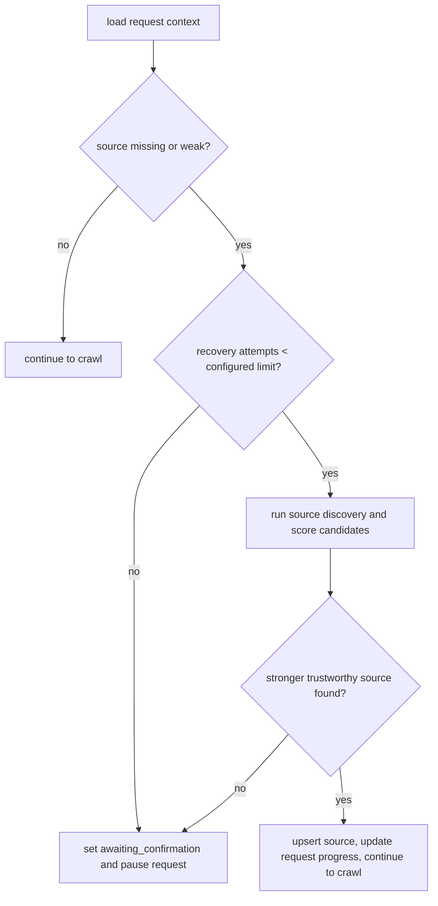
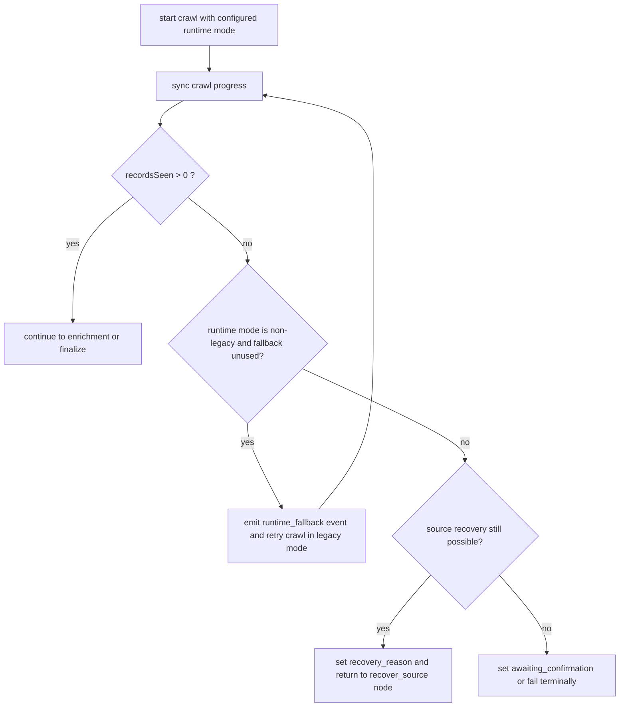
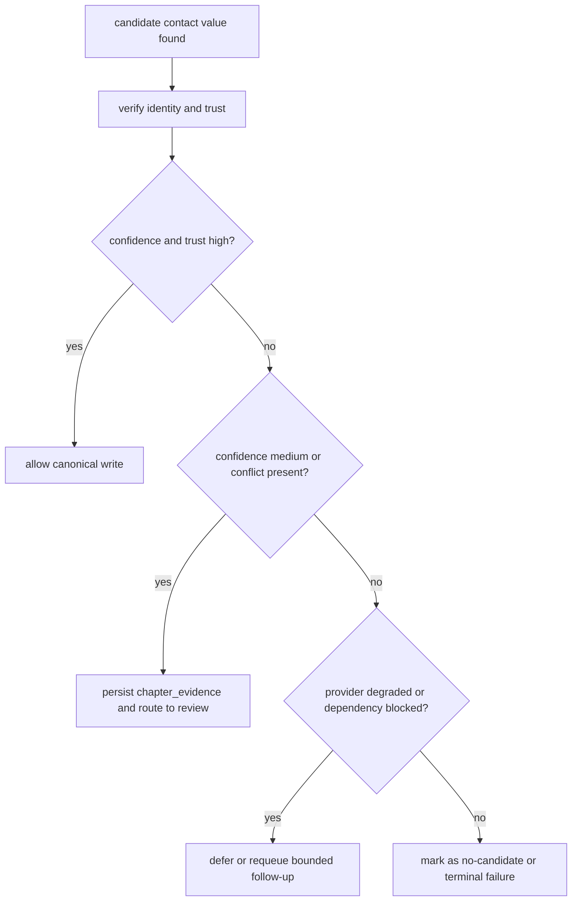
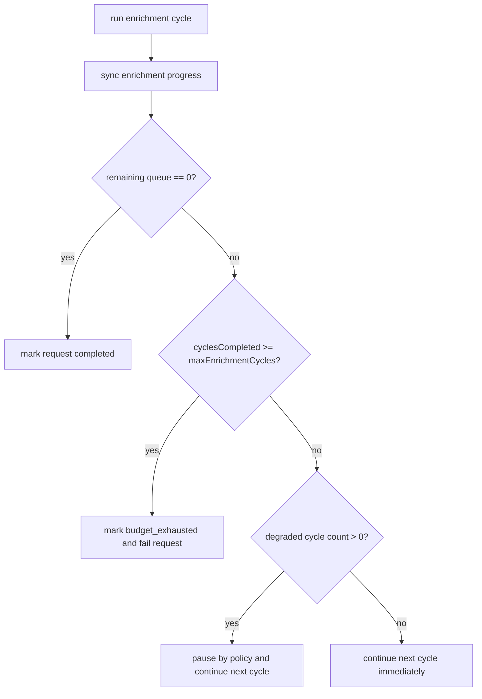

# V3 Decision Trees

This file shows the highest-impact decision logic in the current architecture: source recovery, crawl fallback, and evidence write behavior.

## Source Recovery Decision Tree

## Crawl Runtime Fallback Decision Tree

## Field-Level Evidence Decision Tree

## Enrichment Continuation Decision Tree

