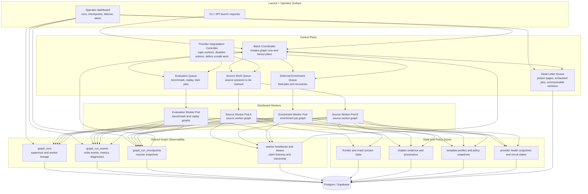

# V3 Distributed Control Plane

This diagram captures the production-grade control plane that sits around the LangGraph runtime.

It fills in the operational pieces that are easy to miss in a pure execution graph:

- distributed work claiming
- checkpoint and heartbeat recovery
- provider degradation controls
- retries and dead-letter handling
- shared graph-run observability

## Distributed Supervisor And Worker Composition

## Recovery Model

- Workers claim bounded units of work with lease ownership.
- Heartbeats keep leases alive while a worker graph is healthy.
- Missing heartbeats allow the coordinator to resume from the latest checkpoint.
- Poison pages and terminal failures route to dead-letter storage for operator inspection instead of hot-loop retries.
- Provider degradation policy can reduce worker concurrency, disable expensive action families, or force defer behavior without changing graph code.
