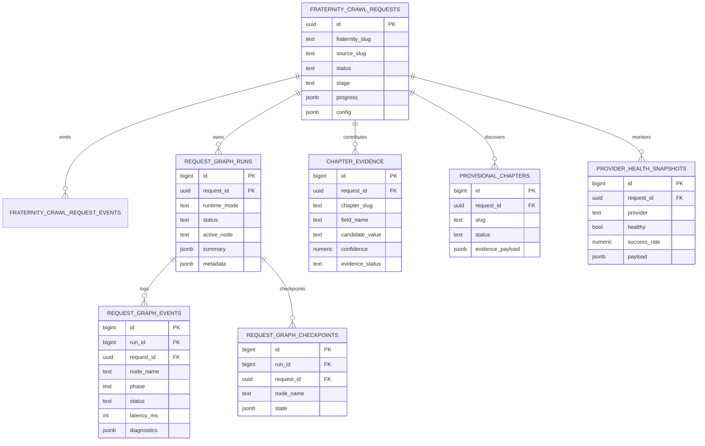
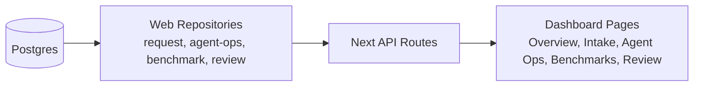
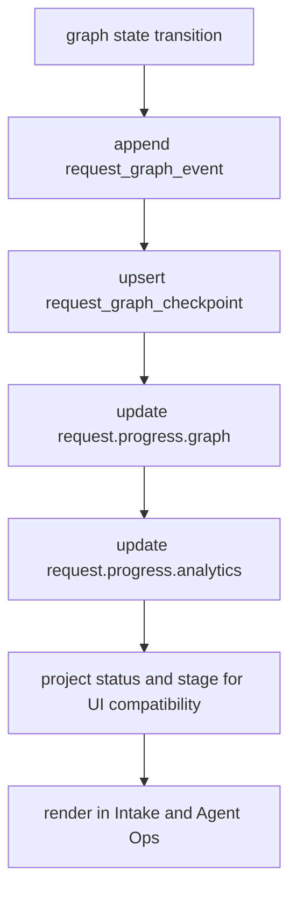

# V3 Interfaces And State

This visual explains how the crawler runtime interfaces with the database and frontend, and how request state is projected for operator workflows.

## Persistence Model

## Interface Projection To Frontend

## Request Progress Projection Contract

The key state projection pattern is that graph internals remain in graph tables, while operator-facing status remains in the request `progress` payload and request stage/status fields.

This keeps backward compatibility for existing dashboards while still exposing graph-native internals to operators.

