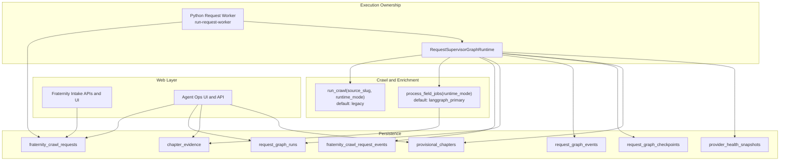

# V3 Latest Architecture Explained

This document explains the latest implemented crawler architecture in plain language and connects each major behavior to the runtime that is currently in production-like use.

The short version is: V3 keeps the existing request intake model for operators, but moves execution ownership to a Python request worker that runs a LangGraph supervisor flow. The system is now graph-supervised end to end at the request level, while the default crawl core is currently `legacy` for source parity and throughput stability.

## What Is Running Today

The architecture now has three levels that matter operationally.

The first level is the request interface layer in the web app. Operators still create, confirm, reschedule, and monitor `fraternity_crawl_requests` through the same intake workflow. This keeps the product experience stable and avoids migration pain for users.

The second level is request execution ownership. When `CRAWLER_V3_ENABLED=true`, the web runner intentionally stands down from actively executing requests. A dedicated Python worker process claims queued requests and executes them through the V3 request supervisor graph.

The third level is graph-supervised orchestration and telemetry. Every request run writes graph run metadata, node events, and checkpoints, then projects back into the existing request status/stage model so legacy UI flows still work.

## End-To-End Crawler Functionality

The full crawler behavior now starts when a new fraternity request is queued and claimed by the worker.

The worker first loads request context and source quality state. If the source is weak or missing, it enters a recovery branch and attempts bounded source discovery/revalidation before any crawl starts. This prevents wasteful runs and improves adaptability for new fraternities where source quality is uncertain.

If source quality is acceptable, the graph enters crawl execution. Crawl is currently launched with `CRAWLER_V3_CRAWL_RUNTIME_MODE=legacy` by default, because live validation showed that adaptive crawl is not yet parity-safe on several large real sources. The important architecture point is that this crawl step is now graph-governed and telemetry-rich, even when the underlying crawl mode is legacy.

After crawl completion, the supervisor syncs crawl progress and evaluates whether enrichment should run. If there is queued enrichment work, it executes bounded enrichment cycles and persists cycle telemetry and queue state on each pass. If enrichment is not needed, it moves directly to provisional evaluation and finalization.

During finalization, the graph writes terminal status and summaries to request graph tables, updates the request row progress payload, and keeps stage/status backward-compatible for the dashboard.

This makes the system adaptive in orchestration, retry behavior, recovery flow, and queue management, while still protecting output quality by defaulting to the most reliable crawl core until adaptive parity is proven.

## Why This Improves Adaptability

The architecture improves adaptability mainly by changing when and where decisions are made.

Previously, many decisions were effectively made by external shell sequencing. Now, source quality checks, fallback behavior, and enrichment progression are explicit graph nodes with durable state transitions.

This means the system can pause and reroute predictably instead of silently failing or repeating weak loops. It also means new fraternity requests that start from uncertain sources can be re-evaluated inside a bounded policy path before the system commits to full crawl work.

## Why This Improves Search And Contact Accuracy

Accuracy improvements come from orchestration discipline and evidence handling, not from unconstrained model behavior.

The system now has an explicit evidence ledger (`chapter_evidence`) and provisional entity path (`provisional_chapters`) with operator visibility in Agent Ops. Request-level graph context is attached to progress payloads so contact outcomes are traceable to runtime behavior.

Enrichment runs through runtime-configured modes with graph durability and per-cycle controls, then writes metrics that can be inspected through API and UI surfaces. This is critical for precision tuning because it gives a stable place to measure quality versus throughput tradeoffs.

## Data-Driven Validation Snapshot

The latest validation report confirms the current architecture behavior:

- V3 request supervisor runs were materially faster than the latest comparable V2 request path in the recorded TKE validation.
- Live queue-drain validation processed two fresh queued requests with zero pending backlog after the worker run.
- Production-build website smoke checks returned `200` for `/`, `/agent-ops`, and `/api/agent-ops`.
- Agent Ops API summary showed zero queued and zero running request backlog during final smoke.

It also confirms one important caveat:

- Adaptive crawl is still not parity-safe on several large sources, so default V3 crawl mode remains `legacy` while graph supervision and telemetry stay active.

## Visual Index

Use the following visuals with this narrative:

- [V3 System Overview](./V3_SYSTEM_OVERVIEW.md)
- [V3 Source Worker Graph](./V3_SOURCE_WORKER_GRAPH.md)
- [V3 Queue Processes](./V3_QUEUE_PROCESSES.md)
- [V3 Decision Trees](./V3_DECISION_TREES.md)
- [V3 Interfaces And State](./V3_INTERFACES_AND_STATE.md)

## Current Runtime Composition

