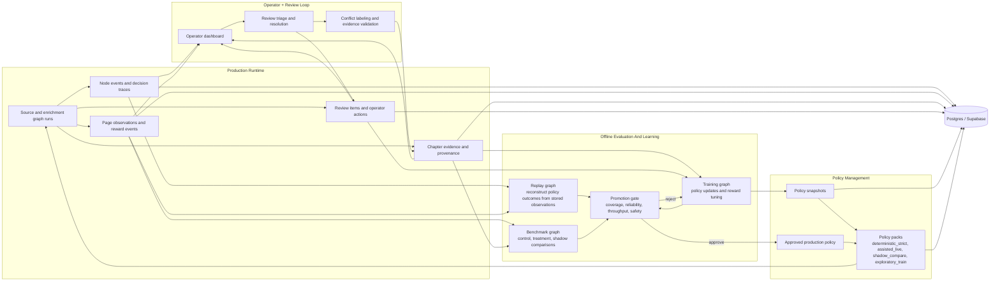

# V3 Learning, Observability, And Review

This diagram shows the hybrid live-plus-offline improvement loop for V3.

It makes explicit how:

- production runs emit telemetry
- operators inspect failures and evidence
- offline replay and training evaluate candidate policy changes
- only approved policy packs return to production

## Feedback Loop

## Hybrid Learning Model

- Production may update live memory such as template profiles, provider health, and evidence confidence summaries.
- Production should not auto-promote broad policy changes without offline replay and benchmark gates.
- Operator review outcomes are training signals, not just audit data.
- Benchmark and replay graphs are first-class workflows because they validate whether a candidate policy is safe to promote.
