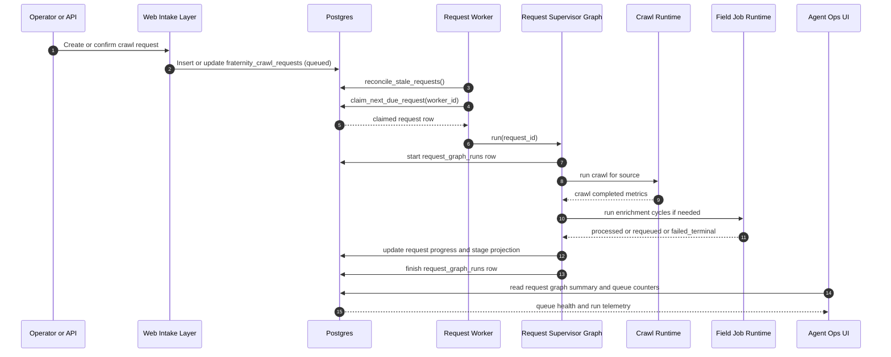
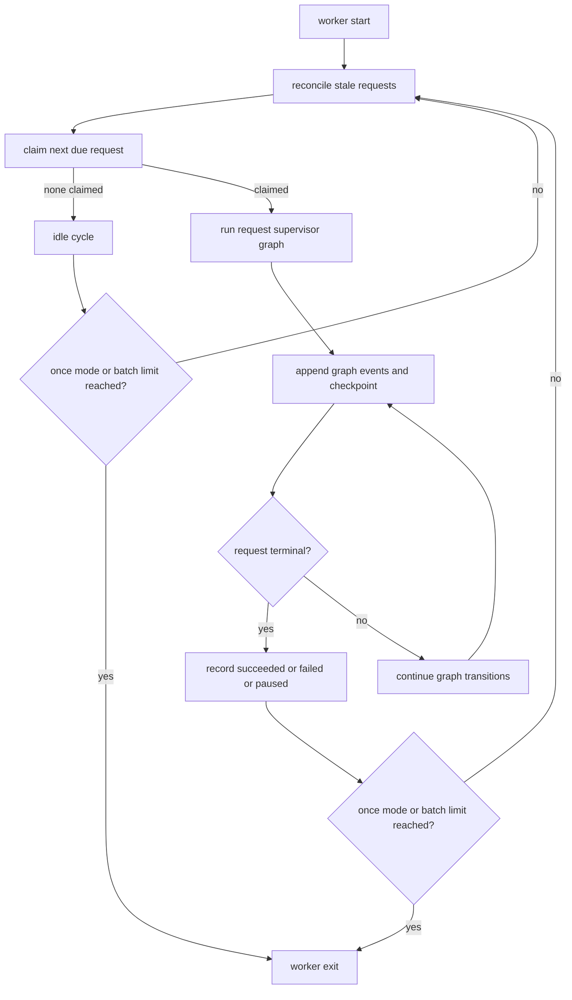

# V3 Queue Processes

This visual set explains how work moves through the current V3 queue model and how bottlenecks are avoided.

## Request Queue Lifecycle

## Internal Queue Control Loop

## Backpressure Signals Used In V3

The current architecture uses concrete queue and runtime signals to decide whether to keep processing or slow down.

- `requestQueueQueued` and `requestQueueRunning` from Agent Ops summary indicate request-level backlog.
- `queued` and `running` field-job totals indicate enrichment pressure.
- `lowProgressCycles` and `degradedCycleCount` in enrichment analytics indicate reduced yield.
- provider preflight and health snapshots indicate whether search-backed enrichment should degrade or defer.

These are not conceptual-only signals; they are persisted and surfaced for operators.

