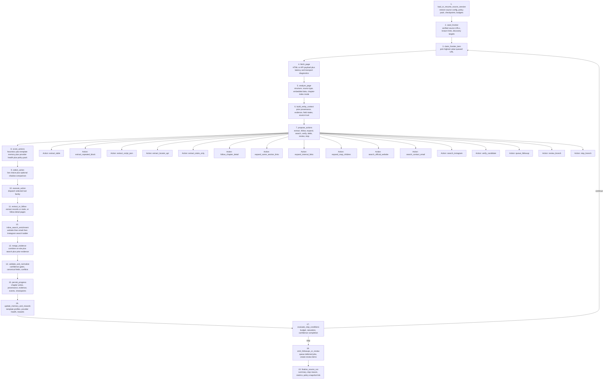

# V3 Source Worker Graph

This diagram shows the end-to-end execution loop for one source crawl worker in the unified V3 runtime.

It combines:

- adaptive navigation
- inline search-backed enrichment
- chapter/entity evidence merge
- checkpoint-safe persistence
- stop conditions and deferred follow-up routing

## Execution Graph

## Node Responsibilities

- `load_or_resume_source_session`: rehydrate source state, budgets, graph-run metadata, and checkpoint lineage.
- `build_entity_context`: attach existing chapter evidence and field state before deciding whether to extract, navigate, or search.
- `inline_search_enrichment`: keeps website, email, and Instagram recovery inside the main crawl loop instead of postponing all enrichment to field jobs.
- `persist_progress`: writes both canonical outputs and graph telemetry so the run can resume safely after failure.
- `emit_followups_or_review`: keeps deferred work bounded by policy instead of letting retries spin in-place.

## Stop Conditions

The worker should stop when one or more of the following becomes true:

- crawl budget exhausted
- low-yield or empty-page saturation reached
- source confidently completed
- provider degradation policy requires defer
- operator-imposed cancellation or supervisor stop signal received
