# V3 System Overview

This diagram shows the layered composition of the V3 LangGraph architecture and distinguishes:

- graph orchestration
- deterministic execution tools
- LLM escalation paths
- shared memory and observability
- persistent storage

## Layered Architecture

```mermaid
flowchart TB
  subgraph OP["Operator + Entry Layer"]
    CLI["CLI / API Launchers<br/>run, process-field-jobs, benchmark, replay, train"]
    UI["Operator Dashboard<br/>graph runs, review, evidence, benchmarks, alerts"]
  end

  subgraph CTRL["LangGraph Control Plane"]
    BSG["Batch Supervisor Graph<br/>source selection, budgets, fanout, aggregation"]
    DSG["Discovery / Revalidation Subgraph<br/>verify national source, trust score, fallback discovery"]
    SCG["Source Crawl Supervisor Graph<br/>schedule source workers, resume checkpoints"]
    FSG["Field Job Supervisor Graph<br/>deferred enrichment, queue routing, retries"]
    ESG["Evaluation Supervisor Graph<br/>benchmark, replay, shadow compare, training"]
  end

  subgraph RUNTIME["Worker Graph Runtime"]
    SWG["Source Worker Graph<br/>crawl one source adaptively"]
    CRG["Chapter Resolution Subgraph<br/>resolve one chapter entity"]
    EJG["Enrichment Job Graph<br/>deferred website, email, Instagram recovery"]
  end

  subgraph TOOLS["Deterministic Tool Layer"]
    FETCH["Fetch Tool<br/>HTTP, retry, pacing, provider diagnostics"]
    ANALYZE["Analyze Tool<br/>page structure, classification, embedded data, index mode"]
    EXTRACT["Extract Tool<br/>table, repeated block, script JSON, locator API"]
    NAV["Navigation Tool<br/>detail-page follow, stub expansion, same-domain traversal"]
    SEARCH["Search Tool<br/>official website, email, Instagram candidate discovery"]
    VERIFY["Verify Tool<br/>host affinity, school match, confidence gates, conflict checks"]
    NORM["Normalize Tool<br/>canonical chapter shape, sanitization, field states"]
    PERSIST["Persist Tool<br/>chapters, provenance, review items, jobs, telemetry"]
  end

  subgraph MODEL["LLM Escalation Layer"]
    LLMCLS["LLM Classification Escalation<br/>ambiguous or unsupported pages only"]
    LLMREC["LLM Recovery Escalation<br/>fallback extraction or conflict explanation"]
  end

  subgraph MEM["Shared Memory + Telemetry"]
    RUNS["graph_runs and crawl_runs<br/>supervisor and worker summaries"]
    EVENTS["graph_run_events<br/>node traces, timings, diagnostics"]
    CKPT["graph_run_checkpoints<br/>durable resume state"]
    FRONTIER["crawl_sessions and frontier items<br/>queued, visited, scored URLs"]
    OBS["page observations and reward events<br/>actions, outcomes, delayed credit"]
    PROFILE["template profiles and policy snapshots<br/>learned action priors"]
    EVID["chapter_evidence<br/>website, email, social candidate ledger"]
    PH["provider_health_snapshots<br/>search and fetch health, degradation rules"]
  end

  DB[("Postgres / Supabase")]

  CLI --> BSG
  UI --> BSG
  UI --> RUNS
  UI --> EVENTS
  UI --> EVID
  UI --> PH

  BSG --> DSG
  BSG --> SCG
  BSG --> FSG
  BSG --> ESG

  SCG --> SWG
  FSG --> EJG
  SWG --> CRG

  SWG --> FETCH
  SWG --> ANALYZE
  SWG --> EXTRACT
  SWG --> NAV
  SWG --> SEARCH
  SWG --> VERIFY
  SWG --> NORM
  SWG --> PERSIST

  CRG --> NAV
  CRG --> SEARCH
  CRG --> VERIFY
  CRG --> NORM
  CRG --> PERSIST

  EJG --> SEARCH
  EJG --> VERIFY
  EJG --> NORM
  EJG --> PERSIST

  ANALYZE -. escalation .-> LLMCLS
  VERIFY -. escalation .-> LLMREC
  EXTRACT -. escalation .-> LLMREC

  PERSIST --> RUNS
  PERSIST --> EVENTS
  PERSIST --> CKPT
  PERSIST --> FRONTIER
  PERSIST --> OBS
  PERSIST --> PROFILE
  PERSIST --> EVID
  PERSIST --> PH

  RUNS --> DB
  EVENTS --> DB
  CKPT --> DB
  FRONTIER --> DB
  OBS --> DB
  PROFILE --> DB
  EVID --> DB
  PH --> DB
```

## Flow Notes

- Solid arrows represent synchronous graph composition or direct tool invocation.
- Dashed arrows represent LLM escalation paths that should only run under ambiguity or recovery policies.
- Memory nodes are shared across crawl, field-job, benchmark, and training workflows so the system learns from one common telemetry substrate.
