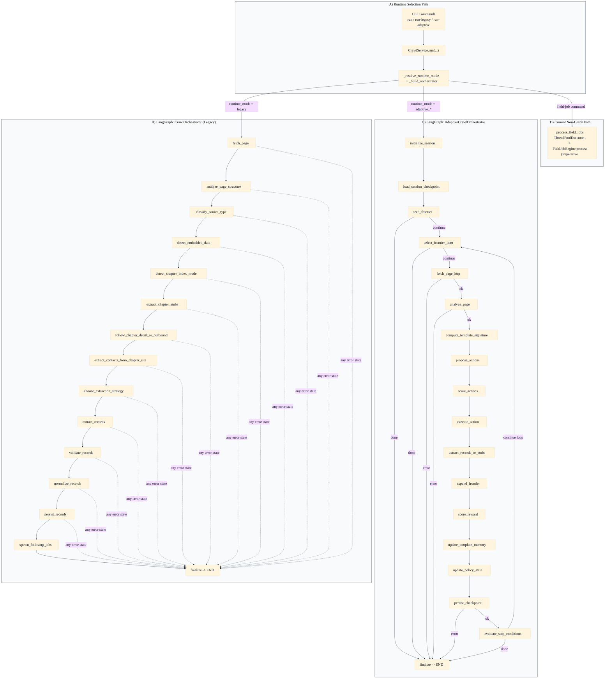

# V4 LangGraph Logic Map (Current Runtime)

This visual maps the **actual LangGraph logic currently implemented** in the crawler service:

- runtime selection in `CrawlService`
- legacy crawl graph topology
- adaptive crawl graph topology and loop
- explicit note for field-job path (currently non-LangGraph)

## LangGraph Runtime Map

## What This Diagram Clarifies

- There are currently **two LangGraph runtimes** in crawl execution.
- Adaptive runtime is truly loop-based with checkpoint and stop-condition control.
- Field-job orchestration is still outside LangGraph, which is the main architecture split.
