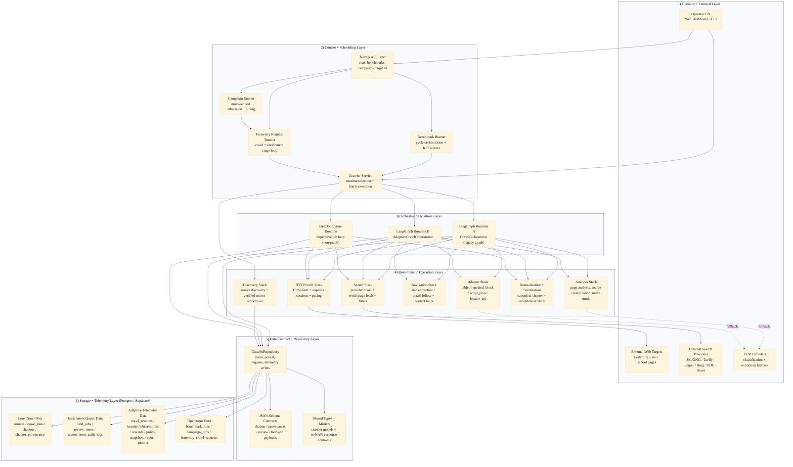

# V4 Platform Architecture (High-Fidelity)

This visual shows the entire platform as a layered runtime system, from operators and APIs down to execution engines and storage.

Goals of this version:

- larger text for readability
- stricter layer boundaries
- explicit runtime ownership (LangGraph vs non-LangGraph)
- clear data and telemetry flow

## Full Platform Visual

## Quick Read

- LangGraph currently powers crawl runtimes (`legacy` + `adaptive`) but not field-job execution.
- Field jobs remain the largest imperative control-flow island.
- Benchmarks and campaign workflows execute crawler commands and feed back into the same queue and telemetry substrate.
