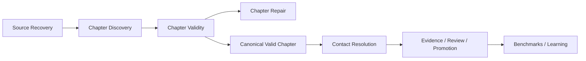
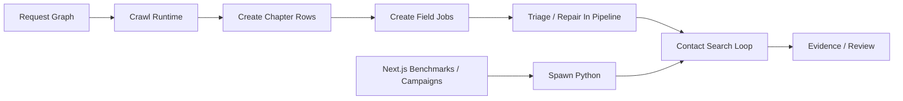
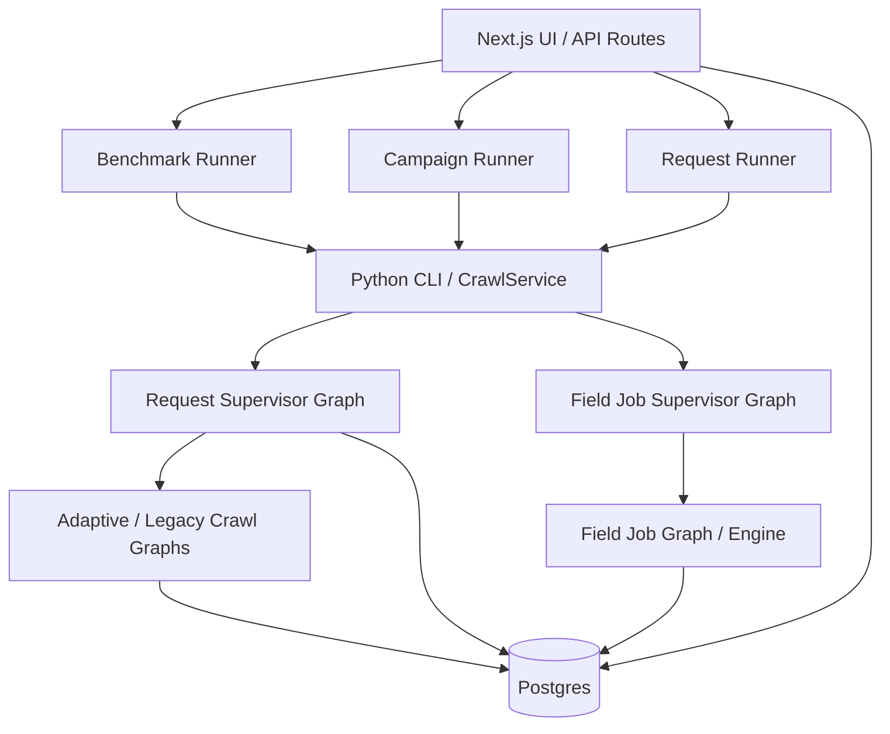
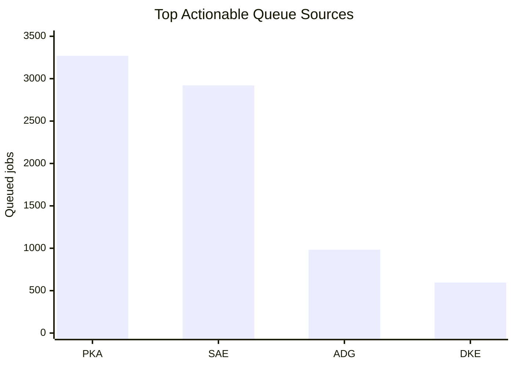
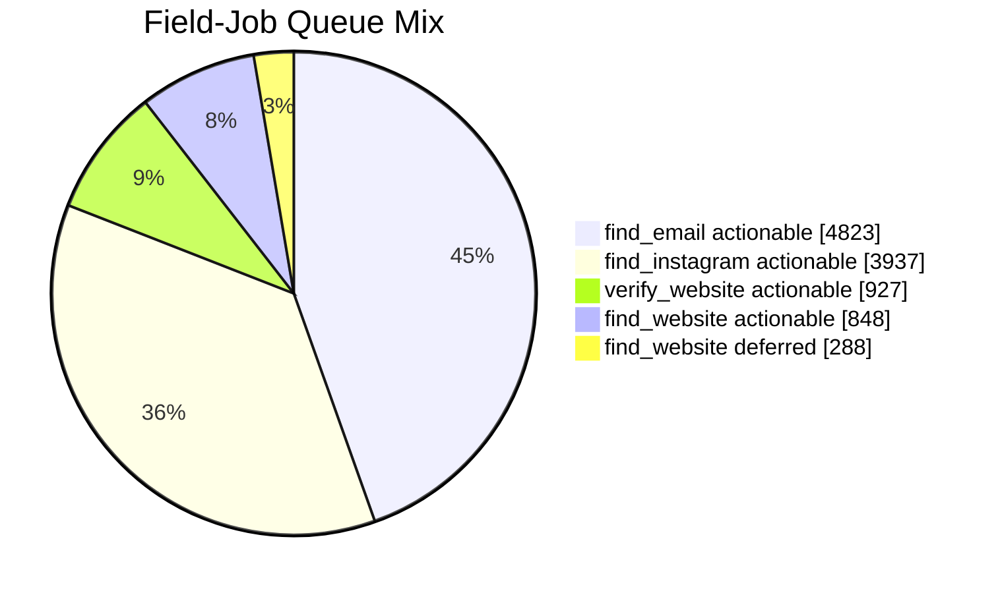
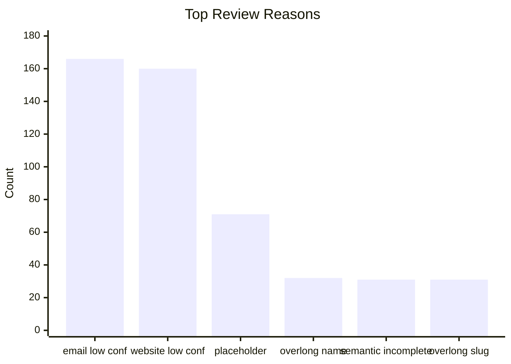
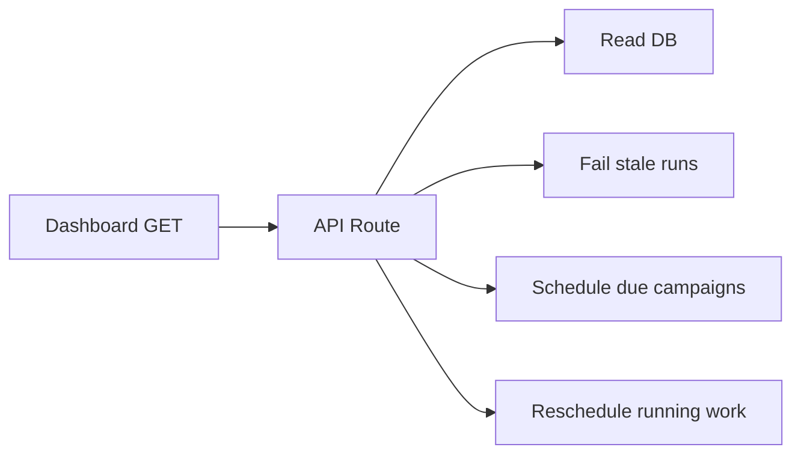
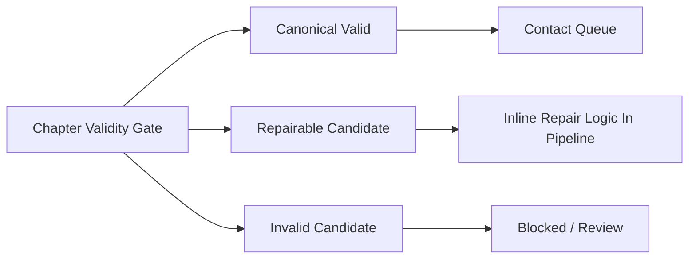
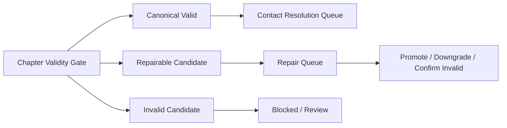
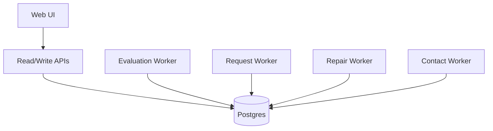

# Queue System Visuals

## 1. Product Goal vs Implementation Reality

The mission-correct architecture above is product-semantic.

Current implementation still behaves closer to this:

## 2. Current Queue Ownership Map

Takeaway:

- web layer still owns long-running scheduling behavior
- Python owns some graphs and some imperative control
- database carries shared truth across all of it

## 3. Live Queue Concentrations

| Source | Actionable queued | Deferred queued | Blocked invalid failed |
|---|---:|---:|---:|
| `pi-kappa-alpha-main` | 3,270 | 42 | 1,027 |
| `sigma-alpha-epsilon-main` | 2,921 | 246 | 614 |
| `alpha-delta-gamma-main` | 983 | 0 | 787 |
| `delta-kappa-epsilon-main` | 595 | 0 | 0 |

## 4. Field-Job Queue State Distribution

| Queue state / field | Count |
|---|---:|
| actionable `find_email` | 4,823 |
| actionable `find_instagram` | 3,937 |
| actionable `verify_website` | 927 |
| actionable `find_website` | 848 |
| deferred `find_website` | 288 |

## 5. Runtime Footprint Comparison

| Runtime artifact | Count |
|---|---:|
| request graph runs | 4 |
| field-job graph runs | 104 |
| benchmark runs succeeded | 38 |
| benchmark runs failed | 16 |
| campaign runs succeeded | 3 |
| campaign runs failed | 7 |

Interpretation:

- field-job work dominates current runtime traffic
- evaluation and campaign control is still failure-prone
- request-graph footprint is small compared with downstream queue operations

## 6. Review-Reason Pressure

| Review reason | Count |
|---|---:|
| low-confidence `contact_email` candidate | 166 |
| low-confidence `website_url` candidate | 160 |
| placeholder/navigation chapter record | 71 |
| overlong chapter name | 32 |
| identity semantically incomplete | 31 |
| overlong slug | 31 |

## 7. Read-Path Anti-Pattern

Problem:

- read paths are mutating operational state
- observability and control are coupled

## 8. Missing First-Class Repair Lane

Current problem:

- repair exists as logic and counters
- repair does not yet exist as a durable queue lane with its own worker type

Target direction:

## 9. Recommended Target Control Plane

Target principles:

- the web app submits and observes
- backend workers own long-running scheduling
- each workload lane has its own concurrency and fairness
- queue-critical state is explicit and typed

## 10. Mission KPI Stack

Operational KPIs are necessary but not sufficient.

The KPI stack should look like this:

1. Product truth KPIs
   - true chapters found
   - false chapters suppressed
   - trusted website/email/Instagram coverage
   - review burden per true chapter
2. Workflow KPIs
   - repair yield
   - provisional promotion rate
   - evidence acceptance rate
   - actionable queue burn-down
3. Infrastructure KPIs
   - jobs/minute
   - requeue rate
   - cycle latency
   - worker saturation

If the system optimizes only layer 3, it can still be fast while doing the wrong work.
